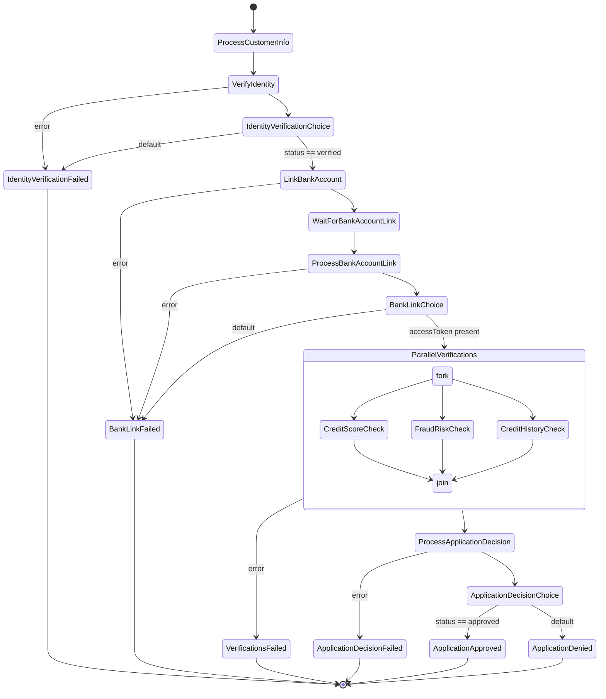

# Step Functions Workflow Diagram

This diagram shows the flow of the customer onboarding state machine implemented with AWS Step Functions.

## Key Features

1. **Error Handling**: Each step has appropriate error handling with dedicated failure paths
2. **Parallel Processing**: Credit score, fraud risk, and credit history checks run in parallel
3. **Decision Points**: Clear decision points determine the flow based on verification results
4. **Wait States**: Accommodates asynchronous operations like bank account linking